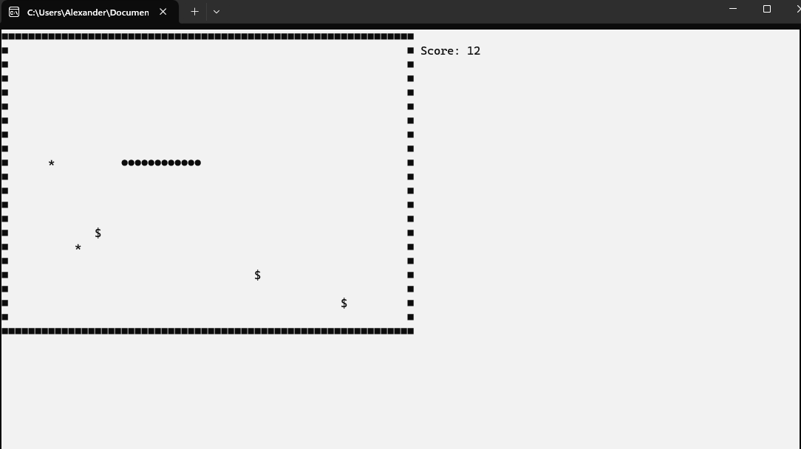

# Snake
Console Snake Game version 2.0 
Created by me from OOP Workshop of SoftUni.  
Structured game with Core, GameObjects, Intefaces, Enums and Utilities.  

# Points: 
- symbol '*' gives 1 point 
- symbol '$' gives 2 points 
- symbol '#' gives 3 points  

When you touch the walls of the field it is game over. You can restart by pressing 'Y'.  

Here you can view screenshot of the game: 
